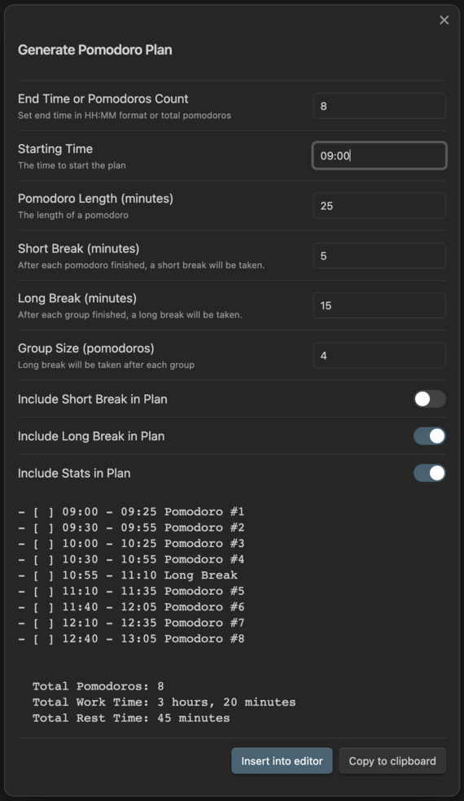

# Obsidian Pomodoro Planner

The Obsidian Pomodoro Planner is a simple plugin that generates a daily plan based on the pomodoro technique with compatible with the Obsidian Day Planner plugin.

## How to use

1. Install the plugin
2. Open the command palette and run the `Pomodoro Planner: Generate` command
3. The plugin will generate a daily plan based on the input
4. You may insert the generated plan to the cursor, or copy it to the clipboard

## Screenshots

---

*Pomodoro Technique is a registered trademark of Francesco Cirillo. This plugin is not affiliated with or endorsed by Francesco Cirillo.*
